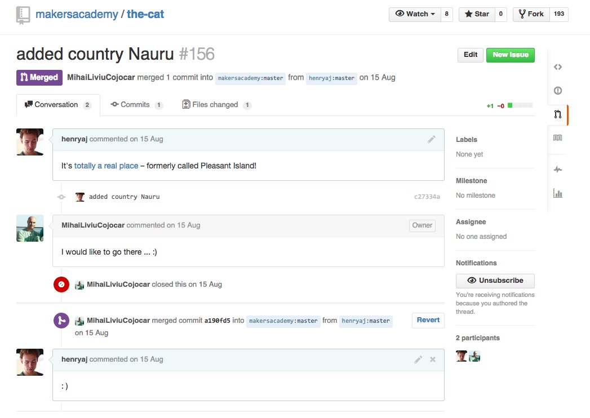

| [*Makers Academy*](http://www.makersacademy.com) | Week 2 |
| ------------------------------------------------ | ------ |

# octocat-challenge

Friday challenge from week 2 at Makers Academy.

## Part 1

We had to demonstrate our understanding of `git` and GitHub by answering some narrative questions and committing the answers to a separate branch – see [here](https://github.com/henryaj/octocat-challenge/tree/answers).

## Part 2

To prove we knew what we were talking about, we had to fork [this repo](https://github.com/makersacademy/the-cat), add a file to it, and then make a pull request to master.

Here's mine: 

https://github.com/makersacademy/the-cat/pull/156

